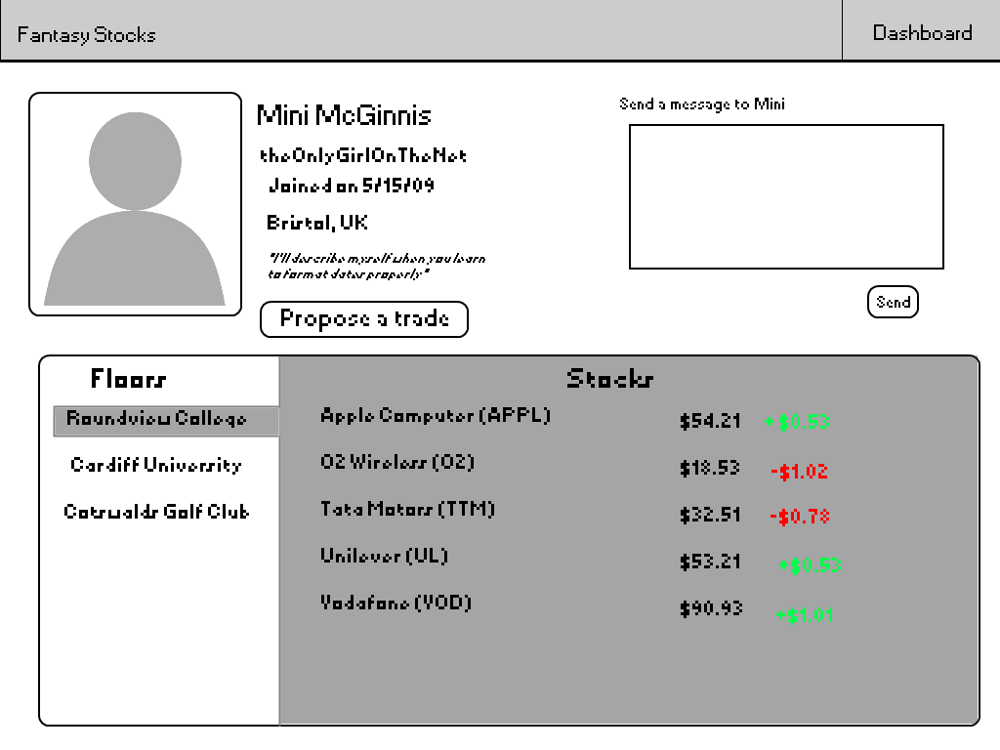
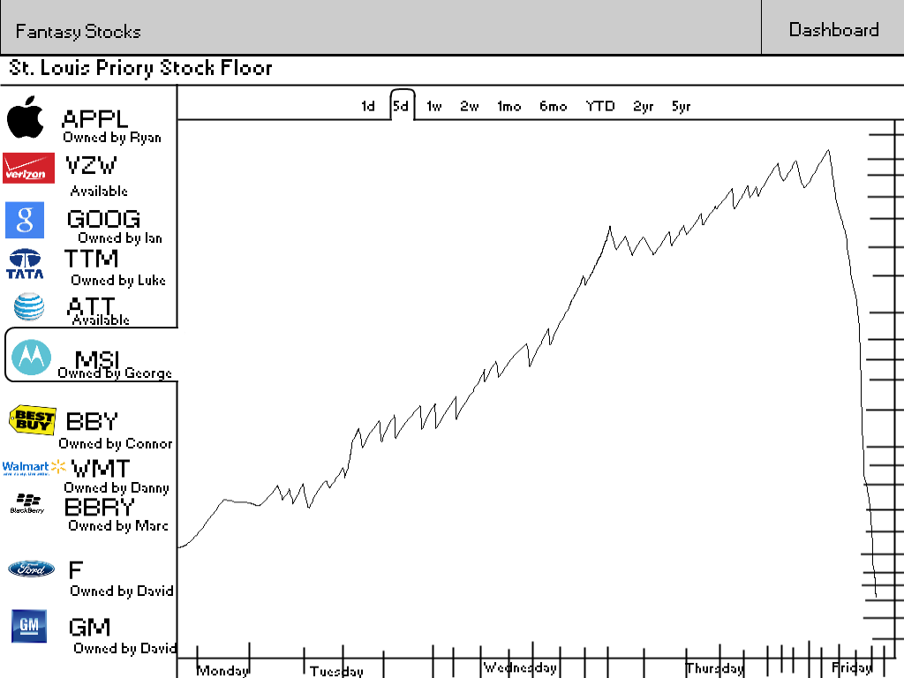

#Fantasy Stocks Spec
######Will Koster
=========
[We will probably use this API to get the stock info](http://dev.markitondemand.com/)

I'm told any good spec should have scenarios for possible users and how they use the product, so I suppose here is a good place to put those.

Scenarios
==========
Scenario 1: Thomas is a high-school student who is not interested in sports, but wants to be able to have a similar communal experience to the one offered by fantasy sports. He and his friends have a fantasy stocks floor (league) and they trade during the day. They have heated debates as to which stocks will go up or down and who should accept or deny what trades.

Scenario 2: Mike is a financial professional who watches the stock market constantly as part of his job. He is an expert and would like to invest himself, but his company and/or the SEC forbid him from doing so. Mike and all of his stock-trader friends make a floor and make ridiculous and risky trades that they could never make in real life, living vicariously through their usernames.

Nongoals:
========
+ There will be no money system. There will be points, but you can't trade them for anything. It's just a number. Some might say "No one will play if you can't trade in your points for anything!" They have not played any mobile games recently.
+ There will not be any mobile apps in this specific repository. Maybe I'll get to an android verison one of these days, but not an iOS version because I don't have a Mac to program on.

###Overview
+ Homepage (index.html)
  + Login page
    + Dashboard
    + <strike>Ticker page
	  + >Open issue: can the ticker page just be sucked into the dashboard and removed?
	  + *Solved* There is no need for a ticker page.</strike>
    + Trade Page
      + Received Trade Page
    + Other player page
    + Floor page
    + Create Floor Page
+ Epilogue: The Game

###Homepage

The homepage will be dominated by a login box, with a username box and a password box, with a submit button below them. Beside that will be a box that is used to register, with a username box, a password box, and another password box below that for confirmation. Below that will be a link to a static page explaining how the game works.
The theory behind this page is that it is really, really simple. The easier it is to sign up, the idea goes, the more people will do it. 

Here is a mockup of the design.

[Here is more explanation of the design](specResources/homepage.png "Homepage")

Both enter buttons only act on their respective boxes. If you fill in one box, then the other, whichever button you click will only send information from its box. If you put in the wrong username or password, it will kick you back to the login page with an angry red message and the username pre-populated with whatever you put in if and only if that username already exists. If it doesn't exist, it will say that no username exists and give you a set of empty boxes. 
>Technical note: I'm pretty sure Django has some sort of authentication feature or something built into it, which should help with this a little.
EDIT: It's called contrib.auth.

>Open issue: Should you have a "forgot password" button? That seems difficult to implement, but I suppose it *is* important...
There is a module for this in contrib.auth that should make this easier. 

###Dashboard

The dashboard will have a few main parts. On the left side, there will be vertically stacked tabs that show the names of all the floors that you are on. If you click on one, it will select and the rest of the page will change to show the things happening on that floor. By default, the floor that is first in alphabetical order will be selected, although there should probably be a setting somewhere that allows you to change that. 
>Question: I was thinking of having an algorithm that would look at what you usually click on and automatically go to that. The problem is that it is possible that it would be very annoying to load the page and have in muscle memory that you need to click on a certain tab, only to find out that it has already been clicked and you just went to a page that you didn't want to go to. This could be fixed by making sure that the tabs aren't re-ordered by the algorithm. 

>Technical note: The tabs will work by JavaScript, not with links like most of the rest of the site. I'll have to have the first page pre-loaded in the HTML, but the rest will be populated in javascript with and XMLHttpRequest that calls some of the Django API, which will fill in the rest of the JavaScript variables necessary to draw the rest of the tabs. By using JavaScript, I should be able to increase speed both of switching tabs and the original load without having a bunch of gross inline JavaScript. It might be hard, however, to get the JavaScript to render the page exactly as it is originally rendered. We'll see. 

Below that there will be a stock-board looking part which will list off all the stocks are being played on that floor and some information about them (price, change that day, points that day, owner, etc.). If you click on any of the stocks, a little javascript bubble will pop up asking if you want to trade for that stock, and if you say yes the trade page will come up with the owner of that stock and the stock pre-populated. Next to that will be a leaderboard which lists out all the other people on your floor in order of how many points they have, with their score next to them. You can click on any player and it will take you to their other player page.
>Open issue: I don't know if I should have a list of things you can do (trade, switch with free agent, send message, etc.) below this, or if I should have some sort of floor-wide message board, or just nothing. I'm leaning hard toward the message board because you can do all the actions by either clicking on players or stocks, and nothing seems a little wasteful, but maybe it would work nicely on small screens. They say that you should design for mobile first and everything else will work itself out, so maybe simple would be best. 
It will also have the same title bar as the homepage, but without the "How it Works" button, and with a "Dashboard" button in its place.

>Technical Note: Use templete inheritance for the title bar. 

NB: This image is no longer accurate. It does not include the recent changes regarding the showing of multiple floors. 

###Trade Page

Design Mockup:

If you click on a stock from the dashboard, or go to a player's page and click "trade", you will come to the trade page. It will have two nearly identical sides. Each side will have a box for a name, with a regular text box that has a real-time suggestions dropdown, just like the Gmail address box. 

>I'm probably going to use [this](https://github.com/twitter/typeahead.js) library for the suggestions functionality. I haven't done that much research on it, but it looks pretty nice at a glance. 

>Technical Note: The implementation of this will be complicated. First, I will need to have a way to get the predefined stocks drawn in the box. I could do this with an XMLHttpRequest, but I think it would be easier to put inject some JSON on the page through the template and then have it render that. I also have to make sure that the box will scroll if there are too many in it, or just tell it to expand as it gets too big. Expanding might be the way to go. I'll also need a way to draw more in real time, which shouldn't be that hard with JavaScript. Then I need to send them back, which could be a little complicated, although I could probably tell JavaScript to patch together an http get and then put that in the url bar instead of just having the submit button be a link. 

The left side top box will always be the same:
>\[Your Username\] (You)

The right side will 99 times out of 100 be pre-populated. If you come from the dashboard, it will be have the name of the person who owns the stock you clicked on. If you come from someone else's player page, it will be populated by the name of the player from whose page you came and no stocks. If you click on a stock on the ticker that is owned by no one, it will be populated with "Floor" (the game equivalent of free-agency).

>Note that you need to go to the trade page to get free agents because you have a limited number of stocks, so in order to get another one, you have to drop one. If you have space open in your roster, you should be able to leave the other box empty and have it work. If I can manage it, I should make a little counter of how many stocks you have and how many you can have on this page so you know.   

If and only if you come from your own player page will it be blank. You will be able to type in a name or "Floor" and it will be filled in automatically.

Right below that box on both sides will be the place where you will list the stocks to trade. It will be equal in width to the name boxes, which together will comprise about 70-75% of the screen, and the height will be 40-50% of the screen. Below each box will me a non-moving text box for you to type into. It will say "Type in a symbol or name" as default, but it will turn blank if you click it. If you clicked on a stock on the dashboard to get to this page, the right lower box, which lists stocks that you wish to receive in the trade, will be pre-populated with that stock, although you can add more. When you type in a stock, a suggestions dropdown will come down to suggest stocks for you. When you press enter to select a stock from the dropdown, it will fill it in.

The items in the list of stocks will have rounded corners, the company logo on the left, followed by the full name, followed by the stock symbol in parenthesis. On the far right side of each stock will be a litle, slightly-transparent, grey "x". This button will remove the stock from the set and therefore from the trade. If you put in more stocks than will fit, there should be a scrollbar. The scrollbars should not sync. When you press enter to put a stock into the trade, the corresponding box should scroll straight to the bottom and show you the the stock you just added. You should be able to search by either symbol or full name. Both sides will have this functionality.

In between the banks of boxes there will be some sort of nice arrow image, probably two greenish arrows, one going each way. Finally, there will be a "Send" button in the traditional style below and with its right side lined up with the right side of the right bank of boxes.

###Received Trade Page

>Technical Note: Make sure you include the parameters for this page when you are writing the template for it. You should probably just have one base template for every page, and this and the Trade Page will be the same template, with the difference being made up in the data that I pass to it.

This will be aesthetically nearly identical to the Trade Page except the "Send" button will be replaced with an "Accept" button, and next to that will be a "Counter-Offer" button, which will take you to a trade page pre-populated with the stocks that were in the trade before, along with the proper names, for you to edit and then send back. If you type in a company name into any of the boxes, it will add to the list just like it would on the trade page.

###Other Player Page

In the top left corner there will be the avatar of the user. Next to that there will be their name, their username, the date they joined, and a motto or something, maybe a description. Something that they wrote, basically. Their location will also be in there somewhere. Below that will be a "Propose a trade" button. If you click on that, it will go to the trade page, with their name and your name pre-populated. To the right of that will be a box that allows you to send a message to the person, with just a big textbox and a "Send" button.

Below that there will be a table. On the left hand side there will be a list of all the floors that the person is a member of. You can click on one (the highest one in order of most recent activity will be pre-selected) and it will select and next to it it will list the stocks they have on that floor next to their price and how they have been doing. The clicking will be handled in JavaScript. When you click, there will be a visual change on top of the text, similar to the above image. I can't get this to look good in paint.net, but the right hand table should have lines delineating the rows and in between the name and the numbers, in the middle. If you click on a stock, you will go to the Trade Page, and the stock, your name, and their name will be pre-populated.
>Make sure that there is some sort of feedback that says that clicking on the stock will take you somewhere else. It could get really annoying really quick if there's not. 

###Floor Page

The floor page will have a left hand column that takes up 20% of the width of the page. At the top will be two tabs, one for "Stocks" and one for "Users." When clicked, the stocks button will show a scrolling list of all the stocks on the floor with their picture on the left and their name to the right of the picture, under which will be written "owned by x" or "available". When clicked, the stock will be highlighted in a similar way to the floors on the player pages. One stock will always be selected, and by default it will be the first one alphabetically. Whatever stock is selected, the remaining width of the page will be filled by a graph showing the stock's historical performance. At the top will be tabs for one day, 5 days, 1 week... year to date, 2 year, etc., which will change the timeframe of the graph. The time will be delimited on the x-axis and it will be formatted differently, depending on which timeframe is selected. If it is one day, it will just be 12-hour formatted times. If it is more than one day but less than or equal to a week, it will be midnight (signified by the name of a day of the week) and noon (signified by "noon"). Longer than that, it will be written as the standard US-formatted date each day at midnight, or at every interval of 1/10 of the total, whatever requires fewer.

If you click on the users button, it will bring up a list of users with their pictures next to them just like with the stocks. The the winning player will be pre-selected, and the list will be in order of most points. When you click on a player, it will bring up a graph of their points with regard to time, just like with the stocks.

Above all this, but below the navigation pane, will be a horizontal bar that lists the name of the floor. 

###Epilogue: The Game

When you first sign up, you get the option to either make a new Floor or join an existing one. If you make a new one, you pick the name and whether it is public or private. You also pick how many stocks everyone gets. 
>About how many stocks should everyone get? I guess it should depend on how many stocks there are in the game, and whether you can add more on the fly or there is a set amount that are included. I think I should aim in development to have a team of 30 people have about 15 stocks each, plus or minus 10. That means either having a very wide and large selection of pre-loaded stocks or being able to add more on the fly. If I were king, you would be able to add more whenever you want. Technically it wouldn't be very hard, but that could conceivably ruin the game. Perhaps you should be able to add more only with the consent of the floor owner and before the draft, and after the draft the field is set. I'll have to think about this one for a bit. 

If the floor is private, you have to invite people to join. If it is public, anyone can join and play. On the player page there should be a search box so you can add more floors. 
Once you're on a floor, you wait for the draft. At the draft, everyone gets to pick stocks just like in a normal draft. After the draft, you just watch how they do. You can trade with anyone at any time, or with the "free agent pool". 

Scores will be calculated by percentages and previous performance so that big-name stocks that always are rising are underpowered and making risky decisions is rewarded. The exact equation will be figured later, but it is important to note its goals: make risky bets on small or falling stocks more appealing and make sitting on big names with guaranteed gains less appealing to make the game more interesting and differentiate it from just watching the real stock market. For example, betting on Palm right before the Pre came out and winning would net many times more points than betting on Google, even if they both rise by the same percentage, because Palm was on a cold streak. 

### Create Floor Page

There will be two sections. The first ("People") one will dictate whether the floor will be private or public, the limit to how big it can be, and how many stocks each person can have. It should warn you if you set it up such that too many stocks will be necessary. Second ("Stocks") will be the available stocks. It will be a vertical list with real-time suggestions just like the trade page, but here all stocks will be available to choose, not just available ones or ones already on the floor. If a stock is chosen that isn't in the database yet, when the floor is created, we will add it and start tracking it. We can use another one of the markitondemand APIs to look up stocks. That might be slow, but we'll see. You should also be able to put in whole indices at once to speed things up. There will also be a checkbox in this division that says the floor's policy on adding new stocks. There will be "closed", where you can't add new stocks at all, "permission", where the owner of the floor can allow or deny the entrance of new stocks, or "open", where the whole stock market is open. At the bottom there will be a submit button. If you click the submit button and there aren't enough stocks at the beginning to have enough for everyone to fill their quota, it will warn you. Of course, this will never happen if the floor is "open". If the floor is set to "permission", you can ignore it or not. If it is "closed", you have to add stocks until everyone can fill their quota. After you click submit and everything is in order, it will take you to the floor page for that floor. 
