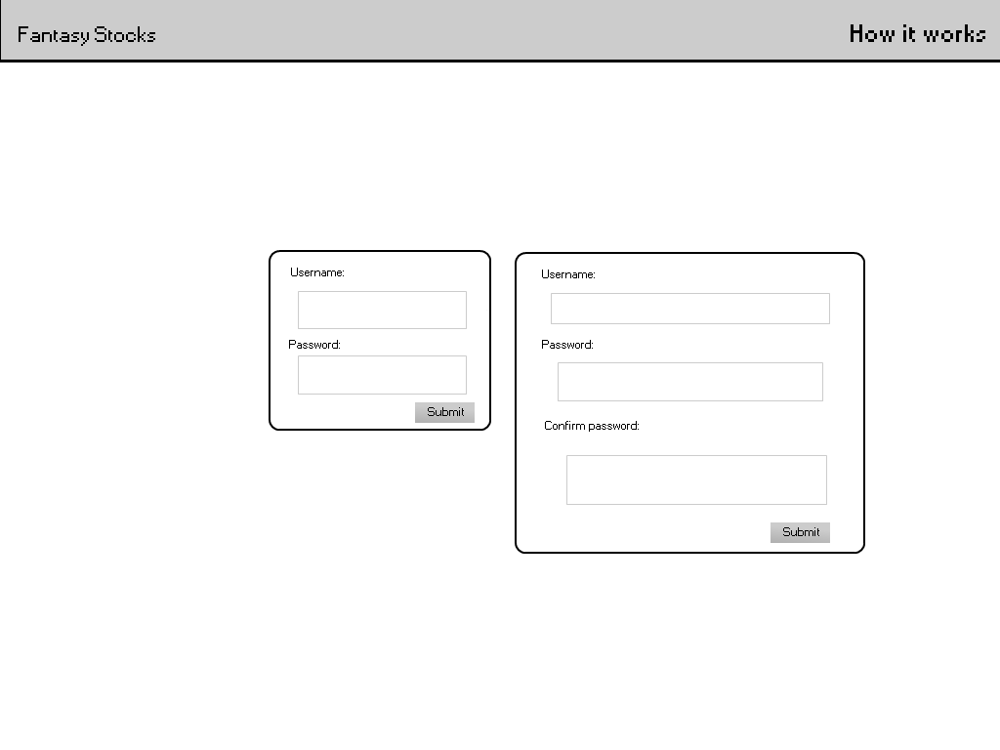

#Fantasy Stocks Spec
######Will Koster
========
> Thus spake the Lord: Thou shalt indent with four spaces. No more, no less. Four shall be the number of spaces thou shalt indent, and the number of thy indenting shall be four. Eight shalt thou not indent, nor either indent thou two, excepting that thou then proceed to four. Tabs are right out. - Some guy on YouTube

[Have some spec knowledge](http://www.joelonsoftware.com/articles/fog0000000035.html)
[We will probably use this API to get the stock info](http://dev.markitondemand.com/)

I'm told any good spec should have scenarios for possible users and how they use the product, so I suppose here is a good place to put those. 

Scenarios 
==========
Scenario 1: Thomas is a high-school student who is not interested in sports, but wants to be able to have a similar communal experience to the one offered by fantasy sports. He and his friends have a fantasy stocks floor (league) and they trade during the day. They have heated debates as to which stocks will go up or down and who should accept or deny what trades. 

Scenario 2: Mike is a financial professional who watches the stock market constantly as part of his job. He is an expert and would like to invest himself, but his company and the SEC forbid him from doing so. Mike and all of his stock-trader friends make a floor and make ridiculous and risky trades that they could never make in real life, living vicariously through their usernames. 

Nongoals: 
========
+ There will be no money system. There will be points, but you can't trade them for anything. It's just a number. Some might say "No one will play if you can't trade in your points for anything!" They have not played any mobile games recently. 
+ There will not be any mobile apps in this specific repository. Maybe I'll get to an android verison one of these days, but not an iOS version because I don't have a Mac to program on. 

###Overview
+ Homepage (index.html)
  + Login page
    + Dashboard 
    + Ticker page
    + Trade Page
    + Other player page
    + Floor page
	
###Homepage

The homepage will be dominated by a login box, with a username box and a password box, with a submit button below them. Beside that will be a box that is used to register, with a username box, a password box, and another password box below that for confirmation. Below that will be a link to a static page explaining how the game works. 

> NB: The specific design and layout of this is subject to change because my design skills are questionable at best. If you think this looks bad and want to change it, do it. With any luck, I'll have a nice picture to explain here soon. 

Here is a mockup of the design. 
 
