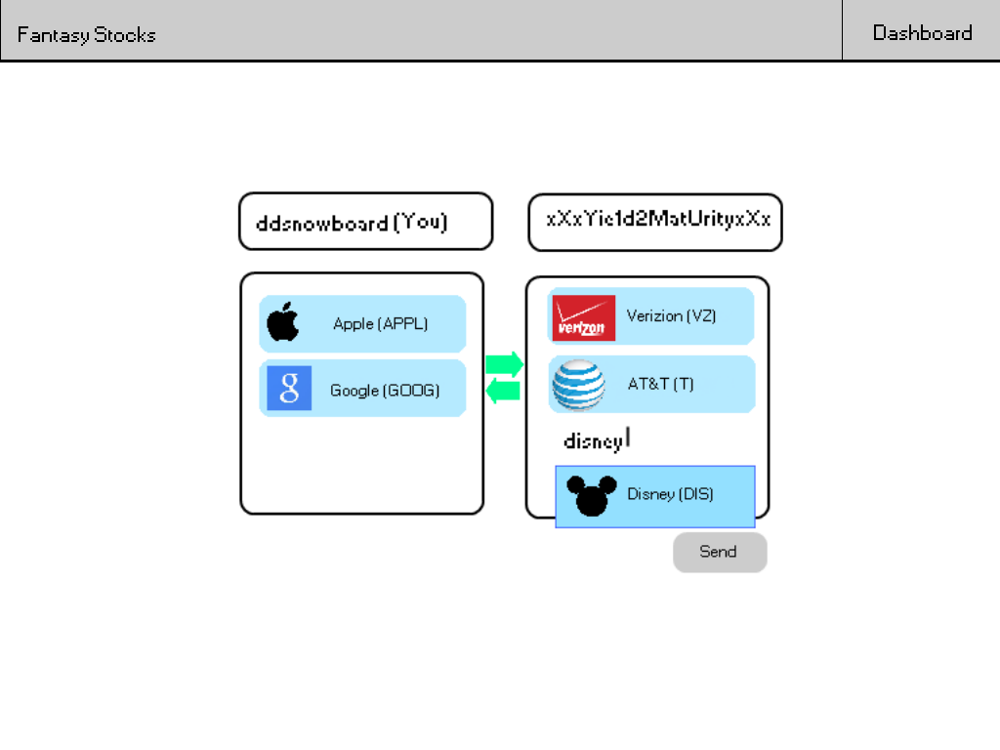

#Fantasy Stocks Spec
######Will Koster
========
> Thus spake the Lord: Thou shalt indent with four spaces. No more, no less. Four shall be the number of spaces thou shalt indent, and the number of thy indenting shall be four. Eight shalt thou not indent, nor either indent thou two, excepting that thou then proceed to four. Tabs are right out. - Some guy on YouTube

[Have some spec knowledge](http://www.joelonsoftware.com/articles/fog0000000035.html)
[We will probably use this API to get the stock info](http://dev.markitondemand.com/)

I'm told any good spec should have scenarios for possible users and how they use the product, so I suppose here is a good place to put those. 

Scenarios 
==========
Scenario 1: Thomas is a high-school student who is not interested in sports, but wants to be able to have a similar communal experience to the one offered by fantasy sports. He and his friends have a fantasy stocks floor (league) and they trade during the day. They have heated debates as to which stocks will go up or down and who should accept or deny what trades. 

Scenario 2: Mike is a financial professional who watches the stock market constantly as part of his job. He is an expert and would like to invest himself, but his company and the SEC forbid him from doing so. Mike and all of his stock-trader friends make a floor and make ridiculous and risky trades that they could never make in real life, living vicariously through their usernames. 

Nongoals: 
========
+ There will be no money system. There will be points, but you can't trade them for anything. It's just a number. Some might say "No one will play if you can't trade in your points for anything!" They have not played any mobile games recently. 
+ There will not be any mobile apps in this specific repository. Maybe I'll get to an android verison one of these days, but not an iOS version because I don't have a Mac to program on. 

###Overview
+ Homepage (index.html)
  + Login page
    + Dashboard 
    + <strike>Ticker page
	  + >Open issue: can the ticker page just be sucked into the dashboard and removed?
	  + *Solved* There is no need for a ticker page.</strike>
    + Trade Page
      + Received Trade Page
    + Other player page
    + Floor page
+ Epilogue: The Game
	
###Homepage

The homepage will be dominated by a login box, with a username box and a password box, with a submit button below them. Beside that will be a box that is used to register, with a username box, a password box, and another password box below that for confirmation. Below that will be a link to a static page explaining how the game works. 

> NB: The specific design and layout of this is subject to change because my design skills are questionable at best. If you think this looks bad and want to change it, do it. With any luck, I'll have a nice picture to explain here soon. EDIT: Here it is!

Here is a mockup of the design. 
 
[Here is more explanation of the design](specResources/homepage.png "Homepage")

Both enter buttons only act on their respective boxes. If you fill in one box, then the other, whichever button you click will only send information from its box. If you put in the wrong username or password, it will kick you back to the login page with an angry red message and the username pre-populated with whatever you put in. 
>Technical note: I'm pretty sure Django has some sort of authentication feature or something built into it, which should help with this a little. 
EDIT: It's called contrib.auth.

>Open issue: Should you have a "forgot password" button? That seems difficult to implement, but I suppose it *is* important...

>Technical note: I'd like to avoid inline javascript if at all possible because it's gross. However, it django breaks all the possible relative path stuff that would allow it to be in the file with the html pages or something, I'm willing to put up with it.

###Dashboard

The dashboard will have a few main parts. There will be a stock-board looking part which will list off all the stocks are being played on your floor and some information about them (price, change that day, points that day, owner, maybe, etc.). If you click on any of the stocks, a little javascript bubble will pop up asking if you want to trade for that stock, and if you say yes the trade page will come up with the owner of that stock and the stock pre-populated. Next to that will be a leaderboard which lists out all the other people on your floor in order of how many points they have, with their score next to them. You can click on any player and it will take you to their other player page. 
>Open issue: I don't know if I should have a list of things you can do (trade, switch with free agent, send message, etc.) below this, or if I should have some sort of floor-wide message board, or just nothing. I'm leaning hard toward the message board because you can do all the actions by either clicking on players or stocks, and nothing seems a little wasteful, but maybe it would work nicely on small screens. 
It will also have the same title bar as the homepage, but without the "How it Works" button, and with a "Dashboard" button in its place.

Hey, it's another picture! 

###Trade Page

Design Mockup:

If you click on a stock from the dashboard, or go to a player's page and click "trade", you will come to the trade page. It will have two nearly identical sides. Each side will have a box for a name, with <strike>either a dropdown menu or</strike> a regular text box that has a suggestions dropdown. 
>EDIT: I've decided that it will be a suggestions dropdown, similar to (If I'm being honest, the same as) the way that the Gmail address box works. 

The left side top box will always be the same: 
>%your_username% (You)

The right side will 99 times out of 100 be pre-populated. If you come from the dashboard, it will be have the name of the person who owns the stock you clicked on. If you come from someone else's player page, it will be populated by the name of the player from whose page you came. If you click on a stock on the ticker that is owned by no one, it will be populated with "Floor" (~free-agency). 

>*Nota haec optime* when you are writing the template for the trade page. 

If and only if you come from your own player page will it be blank. You will be able to type in a name or "Floor" and it will be filled in automatically. 

Right below that box on both sides will be the place where you will list the stocks to trade. It will be equal in width to the name boxes, which together will comprise about 70-75% of the screen, and the height will be 40-50% of the screen. If you clicked on a stock on the dashboard to get here, the right lower box, which lists stocks that you wish to receive in the trade, will be pre-populated with that stock, although you can add more. When you type in a stock, a suggestions dropdown will come down to suggest stocks for you. When you press enter to select a stock from the dropdown, it will fill it in, but not just the text. 

The items in the list of stocks will have rounded corners, the company logo on the left, followed by the full name, followed by the stock symbol in parenthesis. You should be able to search by either symbol or full name. Both sides will have this functionality. 

In between the banks of boxes there will be some sort of nice arrow image, probably two greenish arrows, one going each way. Finally, there will be a "Send" button in the traditional style below and with its right side lined up with the right side of the right bank of boxes. 

###Trade-Received Page

This will be aesthetically nearly identical to the Trade Page except the "Send" button will be replaced with an "Accept" button, and next to that will be a "Counter" button, which will take you to a trade page pre-populated with the stocks that were in the trade before, along with the proper names, for you to edit and then send back. 